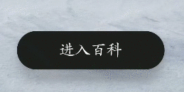
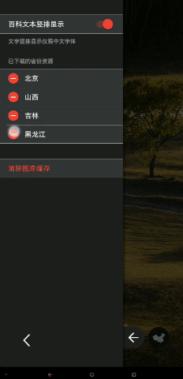
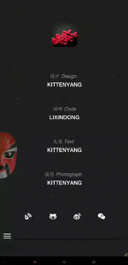
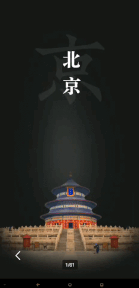

# 华夏万象 Android 版 widget 库

这个库在「华夏万象」Android 版开发过程中产出，仅用做查阅参考、不适合工业使用。

## 目录
1. MarqueeDrawable
跑马灯进度条 drawable

2. StarrySky
星空 drawable

3. ChinaMapView
中国地图带手势版本

4. MenuItemView
带底部菜单的View

5. ParallaxRelativeLayout
纵向的视差滚动布局

6. SegmentProgressBar
分段、可拖动的进度条

7. VerticalTextView
纵向 TextView

8. ShapedImageView
可控制宽高比的 ImageView

9. com.antiless.huaxia.widget.gesture
一个易于扩展的手势检测框架

## 用法

### 1. MarqueeDrawable



```kotlin
/**
 * 跑马灯进度条 drawable
 * @param width 期望宽度 Pixel
 * @param height 期望高度 Pixel
 * @param perWidth 跑马灯每段宽度 Pixel
 */
class MarqueeDrawable(val width: Int, val height: Int, val perWidth: Int) : Drawable(), Animatable

val marqueeDrawable = MarqueeDrawable(width, height, perWidth)
ImageView.setImageDrawable(marqueeDrawable)
marqueeDrawable.progress = 50
```

### 2. StarrySky
星空 Drawable


```kotlin
/**
* 星空 drawable
* @param widthPixels 宽度
* @param heightPixels 高度
*/
class StarrySky(val widthPixels: Int, val heightPixels: Int) : Drawable(), Animatable


val starrySky = StarrySky(widthPixels, heightPixels).apply {
    for (i in 0 until 50) {
        // 添加 50 个随机位置的星星
        addRandomStar()
    }
    // 监听星星跑出范围
    setOnStarOutListener {
        removeStar(it)
        addRandomStar()
    }
}
ImageView.setImageDrawable(starrySky)
// 开始运动
starrySky.start()
// 停止运动
starrySky.stop()
```

3. ChinaMapView
中国地图带手势版本

这个控件基于[ChinaMapView](https://github.com/xin10000/ChinaMapView)
加入了双指操作手势，双指基于第 9 项的手势检测框架


```xml
<com.antiless.huaxia.widget.chinamap.ChinaMapView
    android:id="@+id/itemMap"
    android:layout_width="match_parent"
    android:layout_height="match_parent"/>
```
```java
/**
* 添加不可选区域
*/
void addUnSelectableArea(Area area)
/**
* 设置选中监听
*/
void setOnProvinceSelectedListener(OnProvinceSelectedListener pOnProvinceSelectedListener)
/**
* 设置空白处双击监听
*/
void setOnProvinceDoubleClickListener(OnProvinceDoubleClickListener onDoubleClickListener)
/**
* 设置区域绘制 paint.style 是否为 Paint.Style.FILL
*/
void setPaintColor(Area pArea, int color, boolean isFull)
```

4. MenuItemView
带底部菜单的View, 手势左滑展示底部菜单



```xml
<com.antiless.huaxia.widget.MenuItemView
        android:id="@+id/menuItemView"
        android:layout_width="match_parent"
        android:layout_height="wrap_content"
        app:backViewId="@id/itemMenu"
        app:coverViewId="@id/itemCover"
        app:dragEnable="true">
        <View android:id="@+id/itemMenu"/>
        <View android:id="@+id/itemOver"/>
</com.antiless.huaxia.widget.MenuItemView>
```
```kotlin
fun showBackView()
fun resetBackView()
fun isBackShowed(): Boolean
```

5. ParallaxRelativeLayout
纵向的视差滚动布局



只有一个参数`layout_parallax_speed`，值为1时正常速度滚动，值 0~1 时小于正常速度滚动，>1 时大于正常速度滚动
```xml
<ScrollView>
    <com.antiless.huaxia.widget.ParallaxRelativeLayout
            android:layout_width="match_parent"
            android:layout_height="wrap_content">
            <View app:layout_parallax_speed="0.6"/>
            <View app:layout_parallax_speed="1"/>
            <View app:layout_parallax_speed="1.6"/>
    </com.antiless.huaxia.widget.ParallaxRelativeLayout>
</ScrollView>
```
6. SegmentProgressBar
分段、可拖动的进度条



```xml
<com.antiless.huaxia.widget.SegmentProgressBar
    android:id="@+id/segmentProgressBar"
    android:layout_width="match_parent"
    android:layout_height="wrap_content" />
```
```kotlin
maxSegment  最大值
minSegment  最小值
currentSegment  当前值
showBubble()    显示气泡
hideBubble()    隐藏气泡
bubbleAnimating  气泡是否在动画中
```

7. VerticalTextView
纵向 TextView
```xml
<com.antiless.huaxia.widget.VerticalTextView
    android:text="xxx"
    android:textSize="xxx"
    android:textColor="xxx"
    android:height="textStyle"
    android:letterSpace="height"
    android:textStyle="letterSpace"
/>
<declare-styleable name="VerticalTextView">
    <attr name="text"/>
    <attr name="textSize"/>
    <attr name="textColor"/>
    <attr name="height" format="dimension"/>
    <attr name="letterSpace" format="float"/>
    <attr name="textStyle"/>
</declare-styleable>
```

8. ShapedImageView
可控制宽高比的 ImageView

```xml
<com.antiless.huaxia.widget.ShapedImageView
    android:layout_width="match_parent"
    android:layout_height="wrap_content"
    android:scaleType="centerCrop"
    app:base="widthBased"
    app:heightWeight="1"
    app:radius="4dp"
    app:widthWeight="1" />

<declare-styleable name="ShapedImageView">
    <attr name="widthWeight" format="integer"/>
    <attr name="heightWeight" format="integer"/>
    <attr name="radius" format="dimension"/>
    <attr name="strokeColor" format="color"/>
    <attr name="strokeWidth" format="dimension"/>
    <attr name="base">
        <enum name="heightBased" value="0" />
        <enum name="widthBased" value="1" />
    </attr>
</declare-styleable>
```

9. com.antiless.huaxia.widget.gesture
一个易于扩展的手势检测框架


使用方法很简单:
```java
DisplayMetrics dm = getContext().getResources().getDisplayMetrics();
GesturePointersUtility utility = new GesturePointersUtility(dm);
transformSystem = new TransformSystem(dm, utility);
TransformNode node = new TransformNode(this, transformSystem);

// 内置了单指滑动、双指pinch、双指拖动、双指twist手势识别
// 开发者可自定义手势识别逻辑，注册到TransformSystem中
// 然后实现BaseTransformationController, 将手势识别的结果反应到指定的对象上
// 最后在 TransformNode 中注册自己实现的 Controller
```

**1. 实现 controller **

Controller 用于将手势行为的结果应用到 View 上

ScaleController 是将pinch手势的结果用来缩放

```kotlin
class ScaleController(transformNode: BaseTransformNode, recognizer: PinchGestureRecognizer) : BaseTransformationController<PinchGesture>(transformNode, recognizer) {
    override fun canStartTransformation(gesture: PinchGesture): Boolean {
        return true
    }

    var lastRatio = 1f
    override fun onContinueTransformation(gesture: PinchGesture) {
        if (transformNode.view is ChinaMapView) {
            val pinchRatio = gesture.gap / gesture.startGap
            val startCenterPoint = gesture.startPosition1.center(gesture.startPosition2)
            val scale = pinchRatio / lastRatio
            lastRatio = pinchRatio
            transformNode.view.scale(scale, startCenterPoint.x, startCenterPoint.y)
        }
    }

    override fun onEndTransformation(gesture: PinchGesture) {
        lastRatio = 1f
    }
}
```

**2. 注册 controller**
声明需要使用的 controller

该例中：
双指 pinch 缩放
双指滑动进行拖动
双指 twist 进行平面旋转
单指滑动旋转 3d 视角
```kotlin
class TransformNode(view: View, transformSystem: TransformSystem) : BaseTransformNode(view, transformSystem) {
    private val scaleController: ScaleController = ScaleController(this, transformSystem.pinchGestureRecognizer)
    private val dragController: DragController = DragController(this, transformSystem.doubleFingerMoveGestureRecognizer)
    private val rotateController: RotateController = RotateController(this, transformSystem.twistGestureRecognizer)
    private val visualController: VisualController = VisualController(this, transformSystem.swipeGestureRecognizer)

    init {
        addTransformationController(dragController)
        addTransformationController(scaleController)
        addTransformationController(rotateController)
        addTransformationController(visualController)
    }
}
```

**3. 自定义你的手势识别器**
1. 实现 `BaseGesture` 和 `BaseGestureRecognizer`
2. 使用 `TransformSystem.addGestureRecognizer()` 注册 `YourRecognizer`
3. 实现 `BaseTransformationController<YourGesture>(TransformNode, YourRecognizer)`
4. 使用 `TransformNode.addTransformationController` 注册 `YourController`

**4. 在需要使用手势识别的地方调用**
```java
DisplayMetrics dm = getContext().getResources().getDisplayMetrics();
GesturePointersUtility utility = new GesturePointersUtility(dm);
transformSystem = new TransformSystem(dm, utility);
TransformNode node = new TransformNode(this, transformSystem);
```